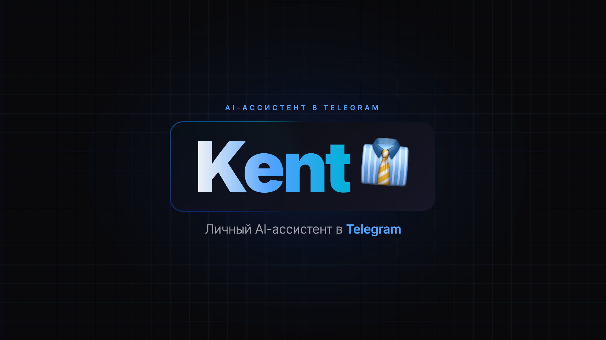
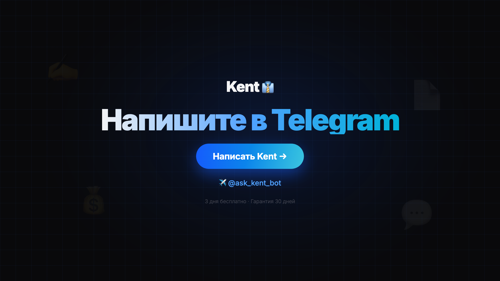

<div align="center">



# Kent AI Assistant

**Production-ready AI-ассистент в Telegram. 17 кастомных скиллов. Деплой одной командой на VPS.**

[Try the bot](https://t.me/ask_kent_bot) · [Architecture](#структура-проекта) · [Deployment](docs/DEPLOYMENT.md) · [Skills](#что-умеет-kent-v1)

</div>

---

## О проекте

Kent — это не "ещё один чат-бот над ChatGPT". Это **цифровой сотрудник**, который доставляется клиенту как готовый Telegram-бот с собственной личностью, долговременной памятью, 17 кастомными скиллами и автоматизацией через cron.

Под капотом — overlay (надстройка) над платформой [OpenClaw](https://openclaw.dev), упакованная в Docker Compose с идемпотентным деплоем, мониторингом, бэкапами, hardened-конфигом (cap_drop ALL, loopback) и интеграциями с Google Workspace, Telegram, ChatGPT/DALL-E, ElevenLabs TTS, Yandex IoT.

Цель — закрыть рутину малого бизнеса (SMM, CRM, документы, финансы, лиды) одним инструментом, который ставится на VPS клиента за 10 минут и стоит дешевле найма помощника.

## Кому интересно

- **Предпринимателям** — как упаковать AI-агента в продаваемый B2B-продукт: [Product Blueprint](docs/business/PRODUCT-BLUEPRINT.md) (концепция, архитектура персоны, скиллов) и [Tech Plan](docs/business/TECH-PLAN.md) (3 варианта деплоя — от ручного MVP до автоматизированной SaaS)
- **Разработчикам** — production-ready overlay над OpenClaw с 17 кастомными скиллами, hooks и cron
- **Клиентам** — `bash install.sh` → персональный бот на твоём VPS за 10 минут

## Быстрый старт

```bash
bash <(curl -fsSL https://raw.githubusercontent.com/Refusned/Kent-Overlay/main/install.sh)
```

Ручной деплой: `prerequisites.sh` -> `configure.sh` -> `deploy.sh`

## Что умеет Kent v1

| | |
|---|---|
| **Core** | Telegram-чат с личностью и памятью, онбординг, голосовые, файлы, генерация картинок, веб-поиск, TTS |
| **Скиллы** | 7 core + 8 beta + 2 experimental ([подробности](READINESS.md)) |
| **Автоматизация** | 5 cron-задач: утренний брифинг, health-check, отчёт, SMM, бэкап |
| **Рецепты** | 31 KentBytes в 6 категориях (бухгалтеры, предприниматели, фрилансеры, юристы, SMM, студенты) |

## Требования

- Ubuntu 24.04 LTS
- 4 GB RAM, 2 vCPU, 40 GB SSD
- Docker 24+
- Telegram Bot Token (от @BotFather)
- Подписка OpenAI Codex (для моделей)

## Документация

| Документ | Описание |
|----------|---------|
| [READINESS.md](READINESS.md) | Матрица готовности всех компонентов |
| [docs/DEPLOYMENT.md](docs/DEPLOYMENT.md) | Гайд по деплою |
| [docs/CONFIG-REFERENCE.md](docs/CONFIG-REFERENCE.md) | Справочник по конфигурации |
| [docs/INTEGRATIONS.md](docs/INTEGRATIONS.md) | Настройка интеграций |
| [docs/TROUBLESHOOTING.md](docs/TROUBLESHOOTING.md) | Решение проблем |
| [docs/CUSTOMIZATION.md](docs/CUSTOMIZATION.md) | Кастомизация под клиента |

## Тестирование

```bash
bash tests/run-all.sh          # static + deploy тесты
bash tests/run-all.sh smoke    # smoke-тесты (требуют запущенный инстанс)
```

Ручной чеклист: [tests/MANUAL-SMOKE-CHECKLIST.md](tests/MANUAL-SMOKE-CHECKLIST.md)

## Структура проекта

```
kent-overlay/
  workspace/           # Рантайм агента: личность, правила, память, скиллы
    SOUL.md            # Характер и тон (432 строки)
    SECURITY.md        # Неизменяемые правила безопасности
    AGENTS.md          # Операционное поведение (602 строки)
    skills/            # 17 кастомных скиллов
    kentbytes/         # 31 рецепт в 6 категориях
  config/
    openclaw.json      # Конфиг OpenClaw (JSON5)
  docker/
    docker-compose.yml # openclaw + browser контейнеры
  tests/               # Автоматические и ручные тесты
  docs/                # 14 файлов документации
```

## Версия

1.0.0 | OpenClaw 2026.4.10 | [CHANGELOG.md](CHANGELOG.md)

---

## Author

Создан и поддерживается **Романом Барминым** ([@Refusned](https://github.com/Refusned)).

Открыт к сотрудничеству по AI-инжинирингу, разработке агентов и автоматизации:
- Telegram: [@ask_kent_bot](https://t.me/ask_kent_bot) (демо-бот) · email: refusned@gmail.com
- Pet projects: Kent (этот репо), Hyper Bot, WB Bot, Agent Teams и др.

<div align="center">



</div>
